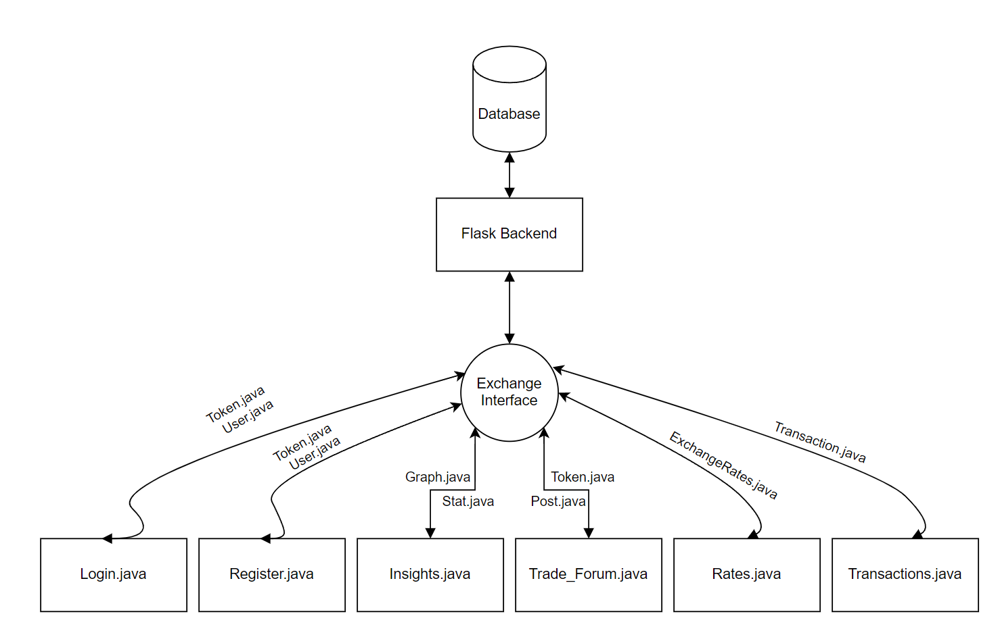

# Desktop Exchange Service

An application that allows a user to add transactions, view exchange rate,
and trade with other users


## Run Locally

Clone the project

```bash
  git clone https://github.com/IssamMisto/430L-Desktop-Frontend
```

Download IntelliJ IDE

```bash
  https://www.jetbrains.com/idea/
```

Download JDK 15

```bash
  http://jdk.java.net/archive/
```

Run the flask server

```bash
  flask run
```

Run

```bash
  Run the application by opening the project within IntelliJ and clicking run
```


## Features

- Registering an account
- Adding Buy/Sell Transactions
- Trading with other users
- Viewing a graph of the exchange rate
- Viewing statistics about the exchange rate
- Viewing your own past transactions

## Diagram Showing the Interaction between Different Classes


## Documentation
### Register Tab
- Allows the user to create a new account
- After creating a new account, the user is instantly logged into their created account
- #### Functions
    - #### public void register(ActionEvent actionEvent)
        - Gets called when the user presses the register button
        - Creates a new user using the inputted username and password and adds the user to the database
        - Calls the authenticate function from the exchangeAPI which allows the user to instantly login after registering
### Login Tab
- Allows the user to login with a pre-existing account
- #### Functions
    - #### public void login(ActionEvent actionEvent)
        - Gets called when the user presses the login button
        - Calls the authenticate function from the exchangeAPI to log the user in
### Exchange Rate Tab
- Allows the user to add a new transaction
- Displays the Buy&Sell rates
- Allows the user to calculate the value of a transaction
- #### Functions
    - #### public void fetchRates()
        - Fetches the Buy&Sell rates from the database by calling the getExchangeRates function from the exchangeAPI
        - Is called when the tab is first opened and when a new transaction is added

    - #### public void addTransaction(ActionEvent actionEvent)
        - Gets called when the user presses the add transaction button
        - Creates a new transaction using the filled in fields
        - Calls the addTransaction function from the exchangeAPI to add the transaction to the database
        - Takes into account the token of the user so that each transaction is associated with its respesctive user
        - If the user is not logged in, the transaction is anonymous
    - #### public void swap(ActionEvent actionEvent)
        - Gets called when one of the radio buttons is pressed
        - Displays the proper label for the exchange rate calculator upon pressing one of the radio buttons
    - #### public void calculate()
        - Gets called when the calculate button is pressed
        - Displays the proper amount of USD or LBP according to the rate
### Insights Tab
- Displays a graph of the exchange rate over a number of days
- Displays some statistics about the exchange rate such as the 1/12/24 hour percentage change in the rate, min/max rate, and the 7 day percentage change in the rate
- ### Functions
    - #### public void SetupGraph()
        - Fetches the data used for the graph 
        - Uses the getGraph function in the exchangeAPI to get the needed values
        - Plots the values on the graph
        - Called when the tab is first selected
    - #### public void getStatsS()
        - Fetches the sell statistics
        - Uses the getStatBuy function in the exchangeAPI to get the needed statistics and displays them
        - Called when the tab is first selected
    - #### public void getStatsB()
        - Fetches the buy statistics
        - Uses the getStatSell function in the exchangeAPI to get the needed statistics and displays them
        - Called when the tab is first selected
### Transactions Tab
- Displays the user's past transactions 
- Uses a TableView to display the transactions
- ### Functions
    - #### public void initialize(URL url, ResourceBundle resourceBundle)
        - Initializes the columns of the TableView with their respective values
        - Fetches the values from the database using the getTransactions function in the exchangeAPI to display all of the user's past transactions
### Trade Forum Tab
- Displays a list of available trades of other users
- The user must be logged in for this tab to appear
- The user can accept the trades from different users
- ### Functions    
    - #### public void add(ActionEvent actionEvent)
        - Allows the user to add a new trade post
        - Uses the addPost fuction in the exchangeAPI to add the trade post to the database
        - Called when the user clicks the add transaction button
    - #### public void get()
        - Fetches a list of available trades posted by other users
        - Uses the getPost function in the exchangeAPI to fetch the list of all available trades and displays them
        - Called when the tab is first selected and whenever a user accepts a transaction
    - #### public void accept(ActionEvent actionEvent)
        - Allows the user to accept a trade request from the list
        - Calls the acceptPost function in the exchangeAPI to accept the trade request
        - The user must enter the id of the request they wish to accept
        - Called when the accept trade button is clicked

### Logout Tab
- Logs the user out of their account

### Exchange API
- Contains the backend routes that are called within the various functions mentioned above
